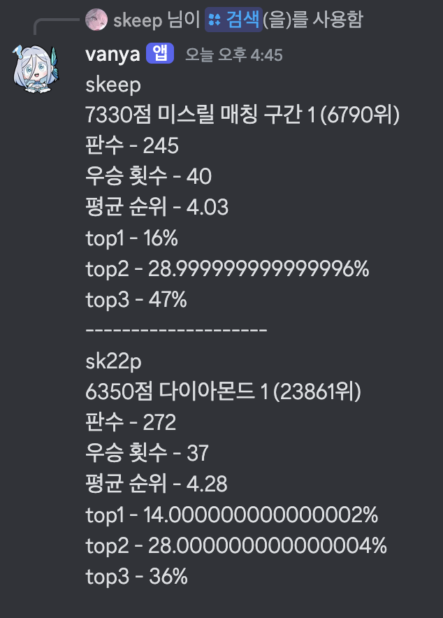
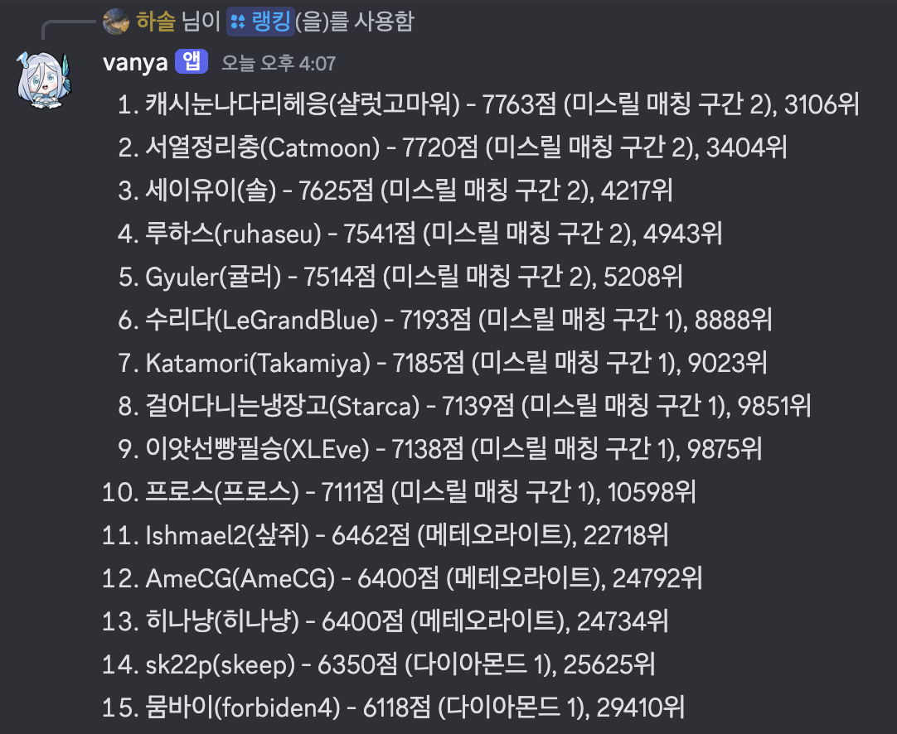
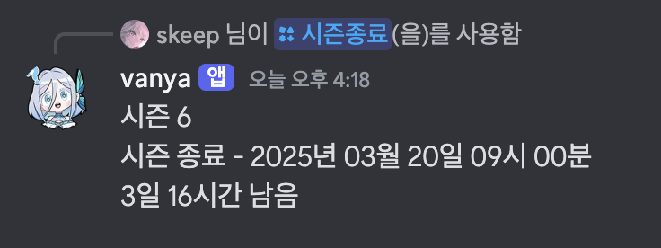
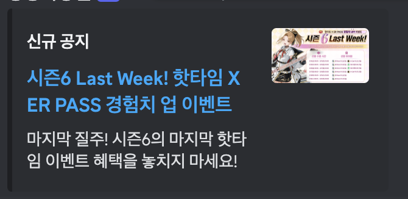
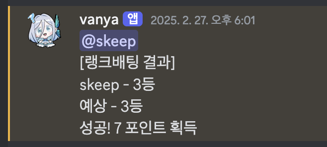
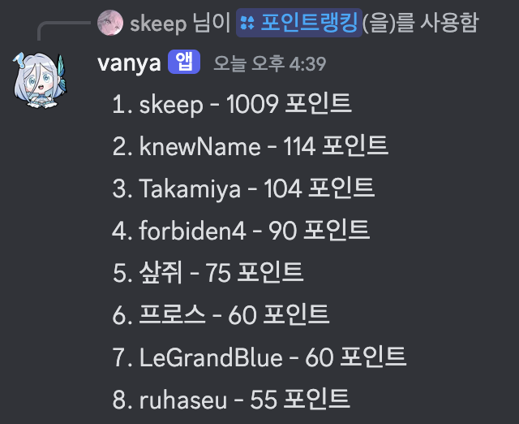

# re-yano

이터널 리턴 디스코드 커뮤니티 서버를 위한 봇

아래 링크를 클릭하면 봇을 서버에 추가할 수 있습니다.

[https://discord.com/oauth2/authorize?client_id=1335482209947353159](https://discord.com/oauth2/authorize?client_id=1335482209947353159)

# 명령어

## 서버 사용자

### 등록

이터널 리턴 닉네임을 입력하면 디스코드 사용자를 시스템에 등록할 수 있습니다. 이후 검색/랭킹 명령어를 사용하게 되면 등록된 사용자를 확인할 수 있습니다.

### 삭제

등록했던 이터널 리턴 닉네임을 입력하면 시스템에서 삭제합니다.

### 검색

디스코드 사용자를 입력하면 해당 사용자가 등록한 이터널 리턴 닉네임의 대략적인 정보를 검색합니다.

### 랭킹

현재 서버에 등록된 모든 사용자의 이터널 리턴 mmr 순위를 보여줍니다. 부계정이 존재할 경우 가장 높은 계정만 보여줍니다.

## 이터널 리턴 정보

### 동접

스팀 기준 동접을 보여줍니다.

### 시즌종료

시즌종료 날짜를 보여줍니다.

### 컷

이터니티 컷(300등)과 데미갓 컷(1000등)을 보여줍니다.

### 구독

이터널 리턴 공식 홈페이지의 새로운 공지사항이 올라오면 명령어를 사용한 채널에 알려줍니다.

### 구독취소

구독 명령어를 사용한 채널에 사용하면 더 이상 새로운 공지사항을 알려주지 않게 됩니다.

## 랭크게임 승부예측

### 출석체크

하루에 한 번 출석체크를 하면 5포인트를 얻을 수 있습니다.

### 랭크배팅

이터널 리턴 닉네임과 예상 순위, 배팅 포인트를 입력하면 다음 게임이 끝날 때 배팅 결과에 따라 포인트를 획득하거나 잃습니다.

이미 진행중인 게임에 대해서는 작동하지 않습니다. 매칭 중이거나 매칭 전에 커맨드를 사용 해 주세요.

### 포인트랭킹

서버에서 명령어를 한 번이라도 사용했던 사용자들의 포인트 순위를 보여줍니다.

